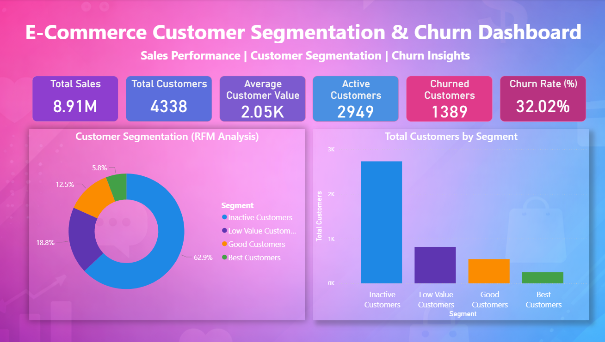
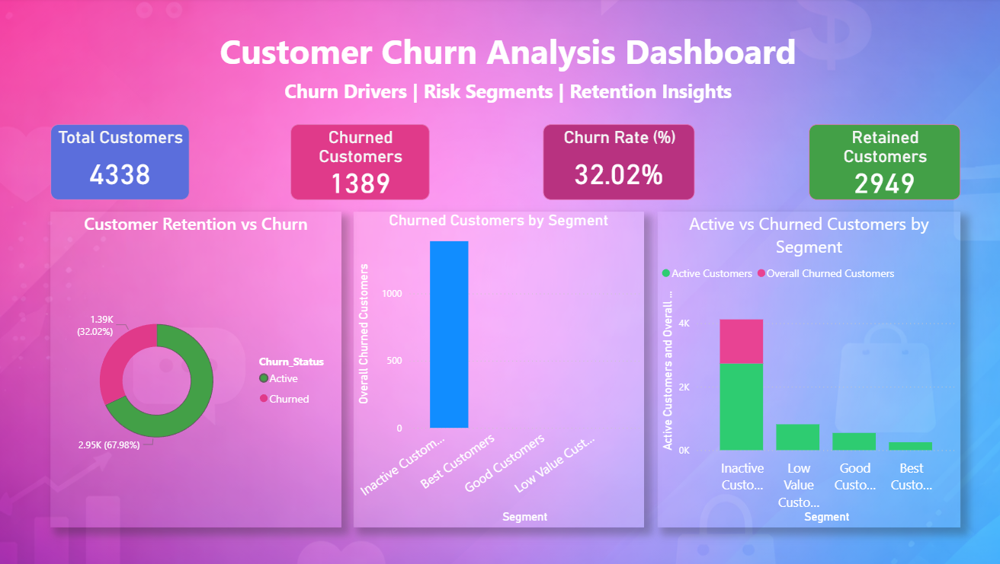
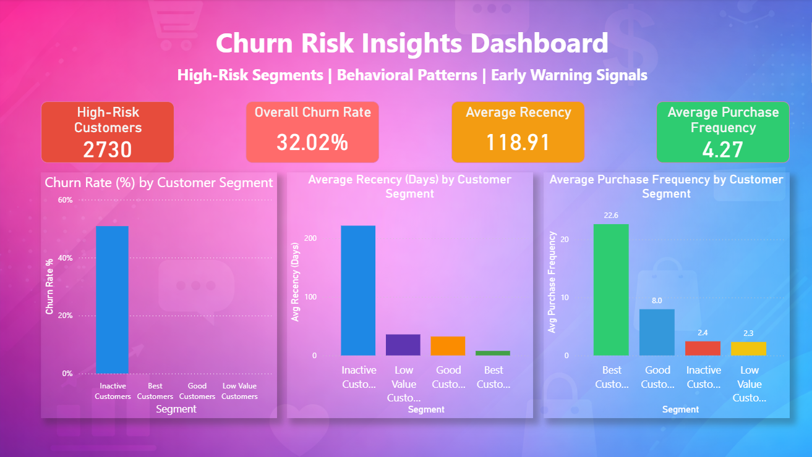

🛒 E-Commerce Customer Segmentation & Churn Prediction Dashboard

📌 Project Overview

This project focuses on analyzing customer behavior, segmenting customers using RFM analysis, and identifying churn patterns in an e-commerce business.
The goal is to help businesses reduce churn, improve retention, and identify high-risk customer segments using Python, SQL, and Power BI.

The project follows a complete data analytics lifecycle:

Data Cleaning & Processing

Exploratory Data Analysis (EDA)

Customer Segmentation (RFM)

Churn Analysis

Interactive Dashboards in Power BI

🧠 Business Objectives

Identify churned vs retained customers

Segment customers based on Recency, Frequency, and Monetary value

Detect high-risk customer segments

Provide actionable insights for retention strategies

🛠️ Tech Stack

Python (Pandas, NumPy, Matplotlib)

SQL (MySQL)

Power BI

📂 Project Structure

Ecommerce-Customer-Segmentation-Churn-Prediction/

│

├── data/

│   ├── raw_data.csv

│   ├── customer_churn.csv

│   ├── customer_rfm.csv

│   └── sales_transactions.csv

│

├── python_scripts/

│   ├── 01_Data_Cleaning.py

│   ├── 02_EDA.py

│   ├── 03_rfm_segmentation.py

│   ├── 04_churn_analysis.py

│   └── 05_mysql_integration.py

│

├── sql/

│   ├── simple_queries.sql

│   └── analysis_queries.sql

│

├── powerbi/

│   └── Ecommerce_Customer_Segmentation_Churn_Prediction.pbix

│

├── reports/

│   ├── Executive_Overview_Dashboard.png

│   ├── Churn_Analysis_Dashboard.png

│   ├── Churn_Risk_Insights_Dashboard.png

│   ├── Ecommerce_Customer_Segmentation_Churn_Prediction_Dashboard.pdf

│   └── Insights_Summary.md

│

├── images/

│   ├── churn_distribution.png

│   ├── monthly_sales.png

│   └── country_sales.png

│

├── requirements.txt

└── README.md

---

## 📊 Power BI Dashboard Snapshots

> Below are snapshots of the interactive Power BI dashboards created in this project.

### 🔹 Executive Overview Dashboard

---

### 🔹 Churn Analysis Dashboard

---

### 🔹 Churn Risk Insights Dashboard

---

## 📈 Key Insights
- Inactive customers show the highest churn rate
- Best customers have low churn and high purchase frequency
- Recency is a strong churn indicator
- Targeted retention strategies can reduce churn risk

---

## 📎 Reports
- 📄 Power BI PDF Report:  
  `reports/Ecommerce_Customer_Segmentation_Churn_Prediction_Dashboard.pdf`
- 📝 Business Insights Summary:  
  `reports/Insights_Summary.md`

---

## 👤 Author
**Sri Ram**  
MCA Graduate | Data Analyst | Python | SQL | Power BI  

🔗 LinkedIn: https://www.linkedin.com/in/sri-ram-sattiraju-028349211
📂 GitHub: https://github.com/Sriram-1704

